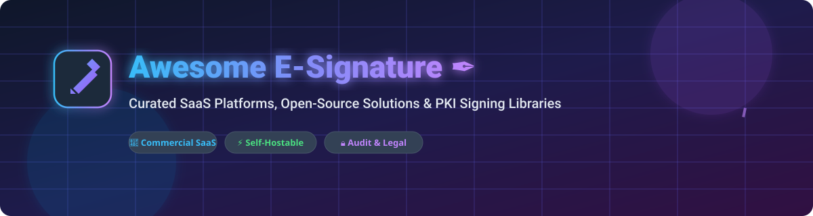

# Awesome E-Signature ✒️

  

  
  
  
  
  
  
  

> A curated directory of **E-Signature (Electronic Signature) SaaS Platforms**, **Self-Hosted Open-Source Projects**, **PDF Digital Signature Libraries**, and **PKI Compliance Tooling** for modern legal, operations, and engineering teams.

---

## 📑 Table of Contents

- [🌐 Overview \& Market Dynamics](#-overview--market-dynamics)
- [🏢 SaaS / Commercial E-Signature Platforms](#-saas--commercial-e-signature-platforms)
- [🔓 Open-Source E-Signature Projects \& Libraries](#-open-source-e-signature-projects--libraries)
- [⚖️ Key Features \& Legal Compliance Framework](#️-key-features--legal-compliance-framework)
- [🤝 How to Contribute](#-how-to-contribute)
- [📈 Star History](#-star-history)
- [💖 Support \& Sponsor](#-support--sponsor)
- [⚠️ Disclaimer](#️-disclaimer)

---

## 🌐 Overview & Market Dynamics

Electronic signature solutions streamline document signing, multi-party workflow routing, digital certificate validation, audit trails, and contract automation. Whether you are searching for enterprise-grade SaaS platforms like DocuSign and Adobe Acrobat Sign or self-hostable open-source alternatives like DocuSeal and Documenso, this list covers the top solutions available.

---

## 🏢 SaaS / Commercial E-Signature Platforms

📊 **Market Insights**: The global electronic signature market is estimated at **~$7.5 Billion to $10 Billion** and is projected to surpass **$35 Billion by 2030** (CAGR ~30%). The sector is **moderately concentrated**, dominated by industry leaders **DocuSign** and **Adobe Acrobat Sign** (holding >60% combined market share), alongside a growing tier of specialized commercial platforms and self-hosted open-source alternatives.

| SaaS Platform | Estimated Company Size / Valuation | Starting Price | Free Tier / Free Trial Limits | Key Highlights & Best For |
| :--- | :--- | :--- | :--- | :--- |
| **[Adobe Acrobat Sign](https://www.adobe.com/)** | ~$200B+ Market Cap ($19.4B Revenue) | $12.99/user/month *(Acrobat Standard)* | 14-day free trial *(Max 2 signature requests during trial)* | Industry standard tight integration with Adobe Acrobat PDF ecosystem & enterprise compliance |
| **[DocuSign](https://www.docusign.com/)** | ~$12B Market Cap ($2.8B Revenue) | $10.00/user/month *(Personal Plan)* | 30-day free trial *(Max 5 document envelope sends during trial)* | Global market leader with extensive integrations, automated workflows & CLM tools |
| **[Dropbox Sign](https://www.dropbox.com/sign)** *(formerly HelloSign)* | ~$8.5B Market Cap ($2.5B Revenue) | $15.00/user/month *(Essential Plan)* | **Free Forever Plan**: 3 signature requests/month; 30-day trial for paid plans | Clean user experience, developer-friendly API, and seamless Dropbox & Google Drive integrations |
| **[Zoho Sign](https://www.zoho.com/sign/)** | ~$1B+ ARR *(Privately held, $10B+ val.)* | $10.00/user/month *(Standard Plan)* | **Free Forever Plan**: 5 documents/month for 1 user; 14-day Enterprise trial | Extremely cost-effective solution deeply integrated into the Zoho ecosystem |
| **[PandaDoc](https://www.pandadoc.com/)** | ~$1B+ Valuation *($100M+ ARR)* | $19.00/user/month *(Essentials Plan)* | 14-day free trial *(Unlimited document sends during trial)* | End-to-end proposal creation, document automation, CPQ, and sales e-signing |
| **[SignNow](https://www.signnow.com/)** *(airSlate)* | ~$1B+ Valuation *($100M+ ARR)* | $8.00/user/month *(Business Plan)* | 7-day free trial *(Max 5 document signature requests)* | Affordable business e-signing with team workflows, custom branding, and mobile apps |
| **[OneSpan Sign](https://www.onespan.com/)** | ~$800M Market Cap *($250M ARR)* | $20.00/user/month *(Professional Plan)* | 30-day developer sandbox / trial *(Max 10 test document sends)* | High-security enterprise e-signature platform with advanced identity verification |
| **[Sertifi](https://www.sertifi.com/)** | ~$30M ARR *($100M+ PE Backed)* | $150.00/month *(Team Plan starting tier)* | 14-day free trial upon demo request | Specialized agreement and payment authorization workflows for hospitality & travel |
| **[SignEasy](https://signeasy.com/)** | ~$20M ARR | $10.00/user/month *(Essential Plan)* | 14-day free trial *(Max 3 document sends during trial)* | Mobile-first signing app designed for seamless performance on iOS, iPadOS, and Android |
| **[Yousign](https://yousign.com/)** | ~$15M ARR *(€50M+ Total Funding)* | €9.00/user/month *(One Plan)* | 14-day free trial *(Max 10 signature requests)* | European market leader offering full eIDAS legal compliance and EU data sovereignty |

---

## 🔓 Open-Source E-Signature Projects & Libraries

These open-source repositories allow teams to self-host e-signature platforms, embed signature widgets, or programmatically apply PAdES-compliant digital signatures to PDF documents.

| Project Name | GitHub_Stars | License | Description & Primary Use Case |
| :--- | :---: | :---: | :--- |
| **[DocuSeal](https://github.com/docusealco/docuseal)** |  | AGPL-3.0 | Modern, self-hostable e-signature platform with visual form builder, API, and webhooks. |
| **[Documenso](https://github.com/documenso/documenso)** |  | AGPL-3.0 | Leading open-source DocuSign alternative built with Next.js, TypeScript, and Prisma. |
| **[Signature Pad](https://github.com/szimek/signature_pad)** |  | MIT | HTML5 canvas-based smooth signature drawing library working across desktop and mobile browsers. |
| **[pdf-lib](https://github.com/Hopding/pdf-lib)** |  | MIT | Create and modify PDF documents in JavaScript/TypeScript, including filling form fields and embedding signature visuals. |
| **[OpenSign](https://github.com/OpenSignLabs/OpenSign)** |  | AGPL-3.0 | Free & open-source e-signature platform featuring sequential signing, completion certificates, and self-hosting. |
| **[PDF Editor](https://github.com/ShizukuIchi/pdf-editor)** |  | MIT | Client-side web application to annotate, edit, and add custom signature images to PDFs in the browser. |
| **[Digital Signature Service (DSS)](https://github.com/esig/dss)** |  | LGPL-2.1 | Official European Commission open-source library for creating, extending, and validating eIDAS compliant signatures. |
| **[node-signpdf](https://github.com/vbuch/node-signpdf)** |  | MIT | Simple Node.js module to inject cryptographic PAdES digital signatures into PDF buffers. |
| **[LibreSign](https://github.com/LibreSign/libresign)** |  | AGPL-3.0 | Nextcloud native electronic signature application for signing documents stored directly inside Nextcloud. |

---

## ⚖️ Key Features & Legal Compliance Framework

When choosing or implementing an electronic signature solution, verify compliance with regional and global legal standards:

- **📜 ESIGN Act & UETA (USA)**: Enforces legal validity of electronic signatures and records for commercial transactions across the United States.
- **🇪🇺 eIDAS Regulation (EU)**: Defines Simple Electronic Signatures (SES), Advanced Electronic Signatures (AdES), and Qualified Electronic Signatures (QES) backed by Qualified Certificates.
- **🛡️ Audit Trail & Evidence Summary**: Captures signer IP addresses, email verification, timestamps, document hashes, and certificate chain details.
- **🔒 Cryptographic Security**: Uses Public Key Infrastructure (PKI), SHA-256 hashing, and X.509 digital certificates to detect document tampering after signature placement.

---

## 🤝 How to Contribute

Contributions are warmly welcomed! Help us keep this directory complete and up to date:

1. 🍴 **Fork** the repository.
2. ✍️ **Add or Update** entries in `README.md` keeping alphabetical or table sorting rules intact.
3. 📝 **Ensure Data Accuracy**: Include platform name, accurate URL, specific pricing details, and open-source license info.
4. 🚀 **Submit a Pull Request** with a brief summary of additions.

Refer to the main catalog curator list at [Awesome-Awesome-Awesome](https://github.com/ishandutta2007/Awesome-Awesome-Awesome).

---

## 📈 Star History

---

## 💖 Support & Sponsor

Thank you for visiting and using **Awesome-E-Signature**! 🌟

If you find this curated list helpful, please consider supporting the project:
- ⭐ **Star** this repository to show your appreciation!
- 🔀 **Fork** and share it with your colleagues and developer community.
- ☕ **Buy me a coffee**: Support ongoing open-source maintenance via [GitHub Sponsors](https://github.com/sponsors/ishandutta2007).

---

## ⚠️ Disclaimer

This repository is a community-curated information directory and does not constitute legal advice. Electronic signature requirements vary significantly by jurisdiction and document classification (e.g., real estate deeds vs. commercial contracts). Always consult qualified legal counsel to ensure compliance with relevant local regulations.
